<picture>
  <source media="(prefers-color-scheme: dark)" srcset="assets/header-dark.svg">
  <source media="(prefers-color-scheme: light)" srcset="assets/header-light.svg">
  
</picture>

  
  
  

---

Computer engineer and solo founder in Dubai. I architect AI systems end to end —
LLM orchestration, wearable health data pipelines, and the backends that hold
them up.

---

<!-- CANVAS:START -->
## The Canvas

**Click any pixel to paint it.** That opens a pre-filled issue — submit it and a
GitHub Action paints your pixel, redraws this grid and closes the issue. No account
setup, no fork, nothing to install. Everyone shares one canvas.

           

 `white`  `black`  `red`  `orange`  `yellow`  `green`  `blue`  `purple`

<strong>80</strong> pixels placed by <strong>1</strong> person

Most recent painters: [@AbdullahKaddoura](https://github.com/AbdullahKaddoura)

Change the colour word in the issue title before submitting. One pixel every
30 seconds per person. How it works:
[`canvas/`](canvas/) · [`.github/workflows/canvas.yml`](.github/workflows/canvas.yml)
<!-- CANVAS:END -->

---

## Projects

| Demo | Repository | What It Does |
| :---: | :--- | :--- |
|  | **[Bizzy](https://github.com/AbdullahKaddoura/Bizzy-Frontend)** · [backend](https://github.com/AbdullahKaddoura/Bizzy-Backend) | AI business co-pilot. Takes a founder from a raw idea to a costed roadmap by routing the conversation through five reasoning engines. |
|  | **[acwr](https://github.com/AbdullahKaddoura/acwr)** | Acute:chronic workload ratio for athlete monitoring. Rolling and EWMA methods, injury-risk zones, zero dependencies. |
|  | **[castit](https://github.com/AbdullahKaddoura/castit)** | Streams a local video to your phone or TV over wifi. Direct-plays when the codecs allow, transcodes with FFmpeg when they don't. |
|  | **[readme-canvas](https://github.com/AbdullahKaddoura/readme-canvas)** | The engine behind the canvas above — a shared pixel grid for any GitHub README, painted through issues. Three files to install. |

---

## Tech Stack

  
  
  
  
  
  
  
  
  
  
  
  

---

If you are working on AI agents, wearable health data, or business automation,
feel free to [connect on LinkedIn](https://www.linkedin.com/in/abdullah-kaddoura-499a48222/)
or email me at [abdullahkaddoura2@gmail.com](mailto:abdullahkaddoura2@gmail.com).
